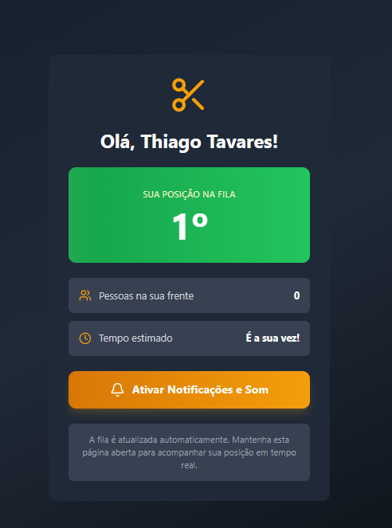
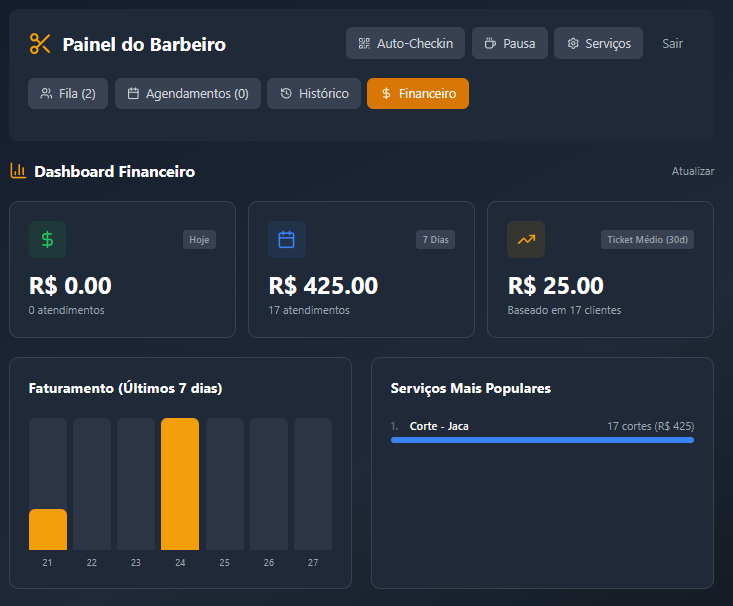
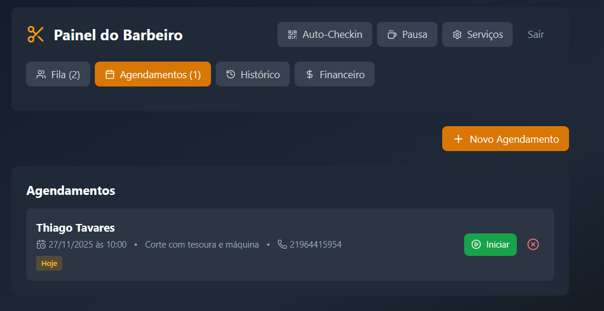
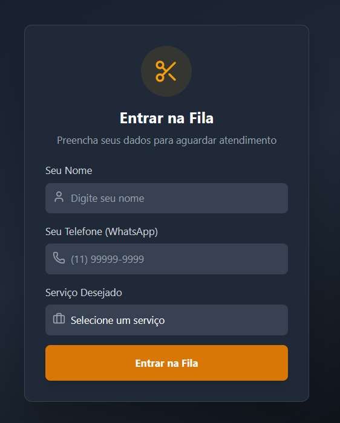
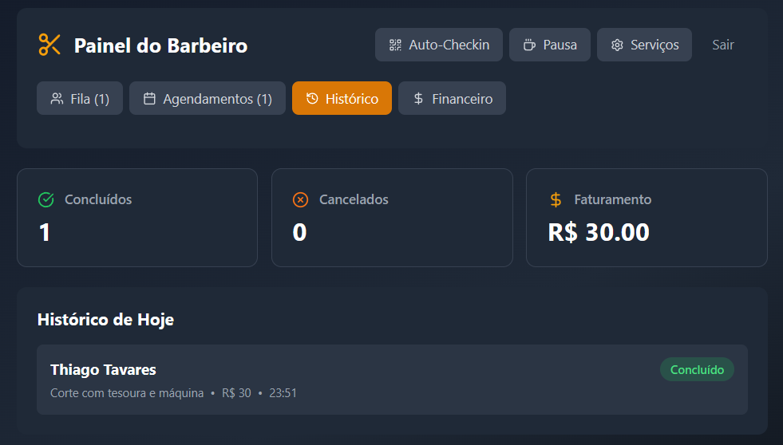

# 💈 Sistema de Gerenciamento de Fila para Barbearia

Sistema completo de gerenciamento de fila para barbearias com painel do barbeiro, visualização do cliente em tempo real, agendamentos, dashboard financeiro e muito mais.

## 📸 Screenshots

### 🎛️ Painel do Barbeiro


*Painel principal com gerenciamento completo da fila, incluindo adição de clientes, reordenação, controle de pausas e integração com WhatsApp.*

---

### 👤 Visualização do Cliente



*Interface em tempo real que o cliente acessa via link personalizado, mostrando sua posição na fila, tempo estimado de espera e informações do serviço.*

---

### 💰 Dashboard Financeiro



*Análise completa de receitas com gráficos de faturamento dos últimos 7 dias, serviços mais populares e métricas de desempenho.*

---

### 📅 Gerenciamento de Agendamentos



*Sistema de agendamentos futuros com visualização organizada, permitindo criar, cancelar e mover agendamentos para a fila ativa.*

---

### 🏪 Auto Check-in



*Tela de auto-atendimento onde clientes podem se adicionar à fila de forma independente, ideal para estabelecimentos com alto fluxo.*

---

### 📊 Histórico de Atendimentos



*Registro completo de todos os atendimentos finalizados e cancelados, incluindo avaliações dos clientes e informações detalhadas.*

---

## ✨ Funcionalidades

### 🎯 Para o Barbeiro

- **Gerenciamento de Fila em Tempo Real**
  - Adicionar clientes manualmente com nome, telefone e serviço
  - Visualizar fila completa com tempo de espera de cada cliente
  - Reordenar clientes na fila (mover para cima/baixo)
  - Finalizar atendimentos com um clique
  - Desfazer finalizações acidentais (10 segundos)

- **Gestão de Serviços**
  - Cadastrar serviços personalizados (nome, duração, preço)
  - Editar e remover serviços existentes
  - Associar serviços aos clientes na fila

- **Agendamentos**
  - Criar agendamentos futuros com data e horário
  - Mover agendamentos para a fila ativa quando o cliente chegar
  - Cancelar agendamentos
  - Visualizar todos os agendamentos pendentes

- **Dashboard Financeiro**
  - Receita do dia, semana e mês
  - Ticket médio mensal
  - Gráfico de faturamento dos últimos 7 dias
  - Serviços mais populares com receita por serviço
  - Número de atendimentos por período

- **Histórico Completo**
  - Visualizar todos os atendimentos finalizados
  - Ver atendimentos cancelados
  - Avaliações dos clientes (estrelas)
  - Filtros por status

- **Recursos Adicionais**
  - Sistema de pausas (coffee break) com timer
  - QR Code para auto check-in
  - Upload de fotos de referência do corte
  - Notificações sonoras quando novos clientes entram
  - Integração com WhatsApp para envio automático de links
  - Edição de dados do cliente
  - Opção para clientes sem telefone (crianças, etc.)

### 👤 Para o Cliente

- **Acompanhamento em Tempo Real**
  - Visualizar posição atual na fila
  - Tempo estimado de espera
  - Informações do serviço escolhido
  - Timer ao vivo mostrando quanto tempo está esperando

- **Notificações**
  - Botão para solicitar reenvio de notificação via WhatsApp
  - Mensagem personalizada com link de acompanhamento

- **Avaliação**
  - Sistema de avaliação por estrelas após o atendimento
  - Efeito de confete ao finalizar avaliação

### 🏪 Auto Check-in

- **Totem de Auto-Atendimento**
  - Clientes podem se adicionar à fila sem intervenção do barbeiro
  - Formulário simplificado com nome, telefone e serviço
  - Geração automática de link de acompanhamento
  - Ideal para estabelecimentos com alto fluxo

## 🛠️ Tecnologias Utilizadas

- **Frontend:**
  - React 19.2.0
  - TailwindCSS (estilização moderna)
  - Lucide React (ícones)
  - Canvas Confetti (efeitos visuais)

- **Backend:**
  - Firebase Firestore (banco de dados em tempo real)
  - Firebase Hosting (hospedagem)

- **Recursos:**
  - Atualização em tempo real com listeners do Firestore
  - Compressão de imagens para otimização
  - Integração com WhatsApp Web API
  - Responsivo para mobile e desktop

## 📦 Instalação e Configuração

### Pré-requisitos

- Node.js (versão 14 ou superior)
- npm ou yarn
- Conta no Firebase

### Passo 1: Clone o repositório

```bash
git clone https://github.com/ThiagoTavaresDev/Barberia-fila.git
cd barbearia-fila
```

### Passo 2: Instale as dependências

```bash
npm install
```

### Passo 3: Configure o Firebase

1. Crie um projeto no [Firebase Console](https://console.firebase.google.com/)
2. Ative o Firestore Database
3. Copie as credenciais do Firebase
4. Crie um arquivo `src/firebase.js` com suas credenciais:

```javascript
import { initializeApp } from "firebase/app";
import { getFirestore } from "firebase/firestore";

const firebaseConfig = {
  apiKey: "SUA_API_KEY",
  authDomain: "SEU_AUTH_DOMAIN",
  projectId: "SEU_PROJECT_ID",
  storageBucket: "SEU_STORAGE_BUCKET",
  messagingSenderId: "SEU_MESSAGING_SENDER_ID",
  appId: "SEU_APP_ID"
};

const app = initializeApp(firebaseConfig);
export const db = getFirestore(app);
```

### Passo 4: Configure as variáveis de ambiente

Crie um arquivo `.env` na raiz do projeto:

```env
REACT_APP_BARBER_PASSWORD=sua_senha_secreta
```

### Passo 5: Configure os índices do Firestore

Importe o arquivo `firestore.indexes.json` no Firebase Console ou crie os seguintes índices compostos:

- Collection: `appointments`
  - Fields: `status` (Ascending), `scheduledDate` (Ascending)

### Passo 6: Execute o projeto

```bash
npm start
```

O aplicativo estará disponível em `http://localhost:3000`

## 🚀 Como Usar

### Acessando o Painel do Barbeiro

1. Acesse `http://localhost:3000/barber` (ou seu domínio + `/barber`)
2. Digite a senha configurada no arquivo `.env`
3. Comece a gerenciar sua fila!

### Configurando Auto Check-in

1. No painel do barbeiro, clique em "Auto-Checkin"
2. Um QR Code será exibido
3. Imprima ou exiba o QR Code na recepção
4. Clientes podem escanear e se adicionar à fila

### Adicionando Clientes

1. No painel, preencha o formulário "Adicionar Cliente à Fila"
2. Insira nome, telefone e selecione o serviço
3. Clique em "Adicionar à Fila"
4. Uma mensagem do WhatsApp será aberta automaticamente com o link de acompanhamento

### Gerenciando Serviços

1. Clique no botão "Serviços" no topo
2. Adicione novos serviços com nome, duração (minutos) e preço
3. Remova serviços que não são mais oferecidos

### Criando Agendamentos

1. Vá para a aba "Agendamentos"
2. Clique em "Novo Agendamento"
3. Preencha os dados e clique em "Agendar"
4. Quando o cliente chegar, clique em "Iniciar Atendimento" para movê-lo para a fila

## 📱 Estrutura de URLs

- `/barber` - Painel do barbeiro (requer senha)
- `/checkin` - Tela de auto check-in
- `/?client=ID` - Visualização do cliente (gerado automaticamente)

## 🔒 Segurança

- Senha do barbeiro armazenada em variável de ambiente
- Autenticação básica para acesso ao painel
- Dados sincronizados em tempo real via Firebase Security Rules

> **Recomendação:** Configure as regras de segurança do Firestore adequadamente para produção.

## 📊 Estrutura do Banco de Dados

### Collection: `queue`
```javascript
{
  name: string,
  phone: string,
  serviceName: string,
  serviceDuration: number,
  servicePrice: number,
  notes: string,
  photoUrl: string,
  joinedAt: timestamp,
  order: number,
  status: "waiting" | "done" | "cancelled",
  completedAt: timestamp,
  rating: number
}
```

### Collection: `services`
```javascript
{
  name: string,
  duration: number,
  price: number
}
```

### Collection: `appointments`
```javascript
{
  name: string,
  phone: string,
  scheduledDate: timestamp,
  scheduledTime: string,
  serviceName: string,
  serviceDuration: number,
  servicePrice: number,
  status: "scheduled" | "moved_to_queue" | "cancelled",
  createdAt: timestamp
}
```

### Collection: `barberStatus`
```javascript
{
  status: "available" | "on_break",
  breakEndsAt: timestamp,
  breakDuration: number
}
```

## 🎨 Personalização

### Cores e Tema

O projeto usa TailwindCSS. Para personalizar as cores, edite o arquivo `tailwind.config.js`:

```javascript
module.exports = {
  theme: {
    extend: {
      colors: {
        // Adicione suas cores personalizadas aqui
      }
    }
  }
}
```

### Mensagens do WhatsApp

As mensagens são geradas em `src/utils/helpers.js`. Personalize conforme necessário:

```javascript
export function generateWhatsAppMessage(client, position, link) {
  return `Olá ${client.name}! 👋\n\n...`;
}
```

## 🤝 Contribuindo

Contribuições são bem-vindas! Sinta-se à vontade para:

1. Fazer um fork do projeto
2. Criar uma branch para sua feature (`git checkout -b feature/MinhaFeature`)
3. Commit suas mudanças (`git commit -m 'Adiciona MinhaFeature'`)
4. Push para a branch (`git push origin feature/MinhaFeature`)
5. Abrir um Pull Request

## 📝 Licença

Este projeto está sob a licença MIT. Veja o arquivo `LICENSE` para mais detalhes.

## 👨‍💻 Autor

**Thiago Tavares**

- GitHub: [@ThiagoTavaresDev](https://github.com/ThiagoTavaresDev)

## 🙏 Agradecimentos

- Firebase pela infraestrutura em tempo real
- Lucide React pelos ícones incríveis
- Comunidade React pelo suporte

---

⭐ Se este projeto foi útil para você, considere dar uma estrela no repositório!
